# Java Operations Documentation

@[/home/dev/Projects/java/Java-learn]

### Linkdin_List/Linkdin_list.java

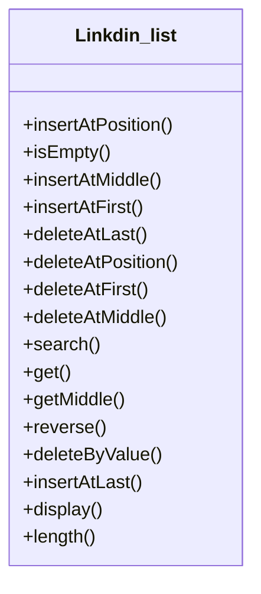

@[/home/dev/Projects/java/Java-learn]

### Linkdin_List/DoublyLinkedList.java

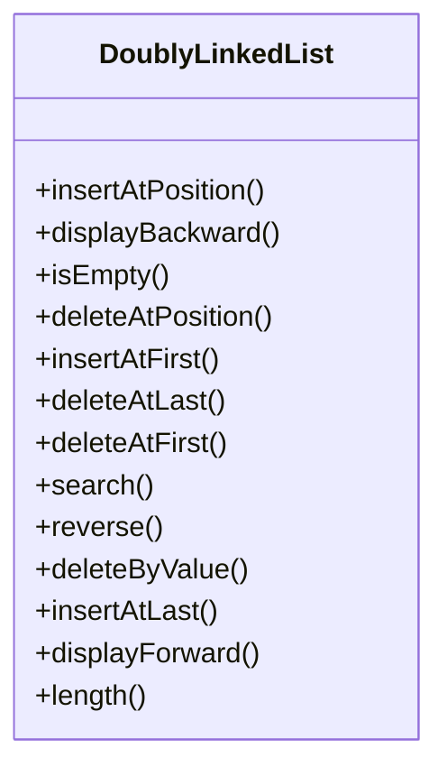

@[/home/dev/Projects/java/Java-learn]

### Linkdin_List/CircularLinkedList.java

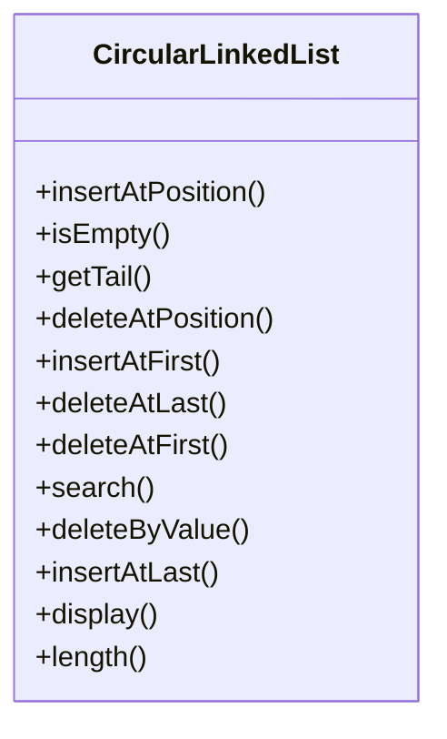

@[/home/dev/Projects/java/Java-learn]

### non-linear-data/ graph/Graph.java

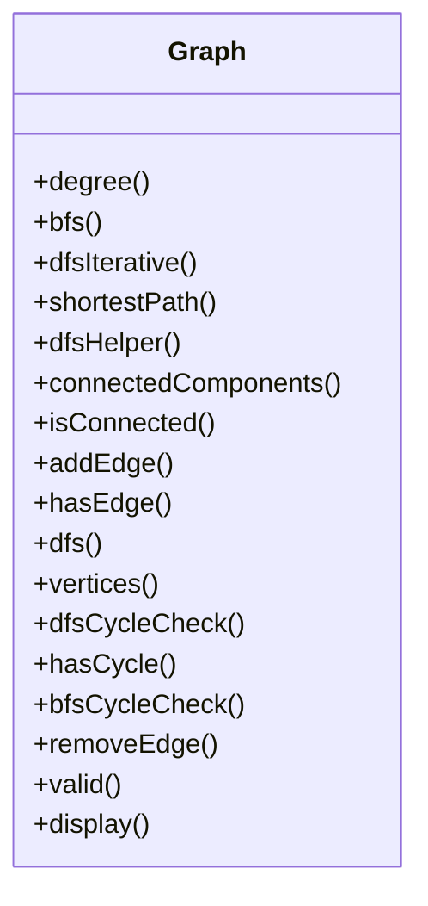

@[/home/dev/Projects/java/Java-learn]

### non-linear-data/Trees/Heap.java

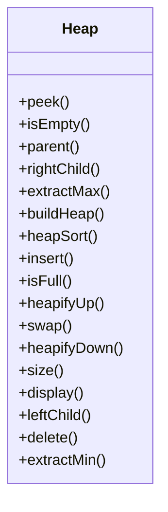

@[/home/dev/Projects/java/Java-learn]

### non-linear-data/Trees/AVLTree.java

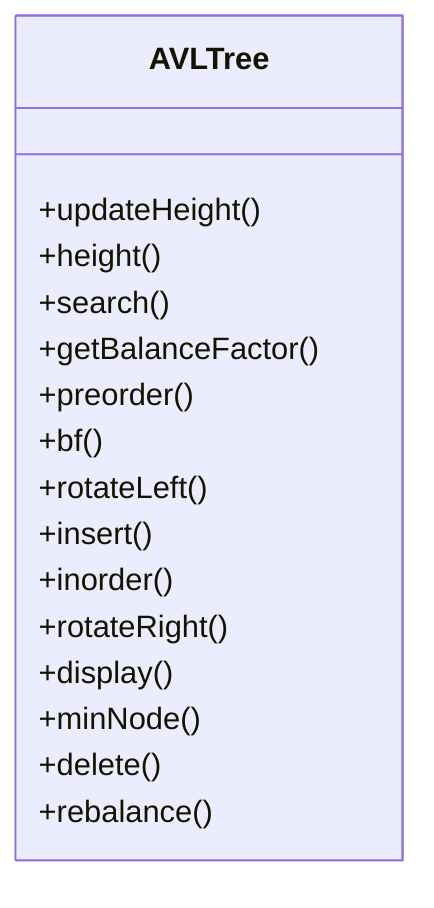

@[/home/dev/Projects/java/Java-learn]

### non-linear-data/Trees/BST.java

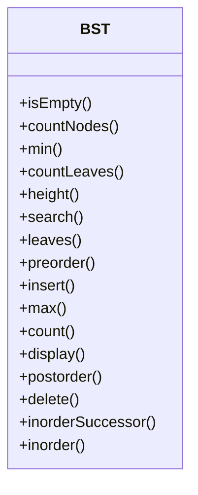

@[/home/dev/Projects/java/Java-learn]

### non-linear-data/Trees/BinaryTree.java

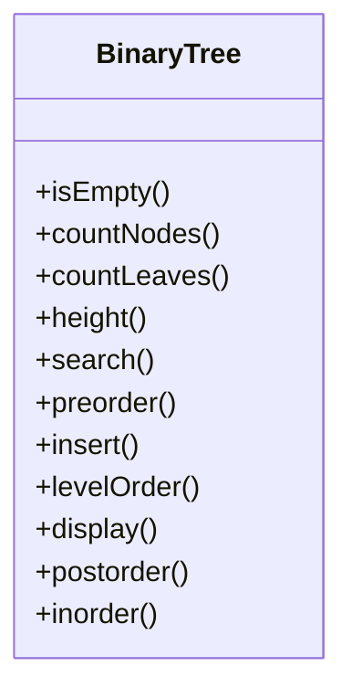

@[/home/dev/Projects/java/Java-learn]

### Queue_DSA/LinkedQueue.java

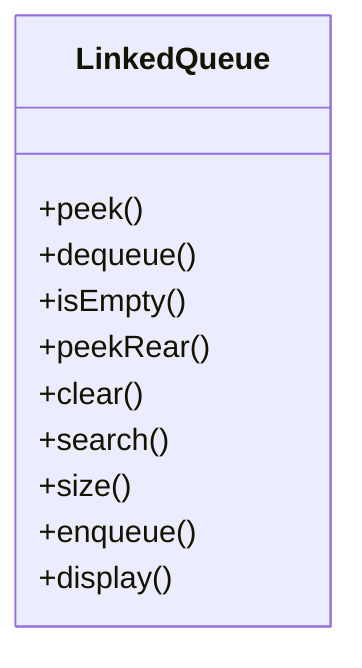

@[/home/dev/Projects/java/Java-learn]

### Queue_DSA/CircularQueue.java

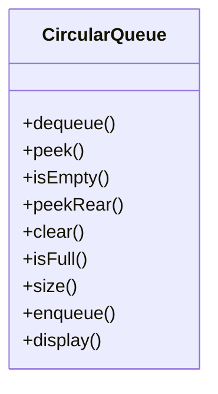

@[/home/dev/Projects/java/Java-learn]

### Queue_DSA/PriorityQueue.java

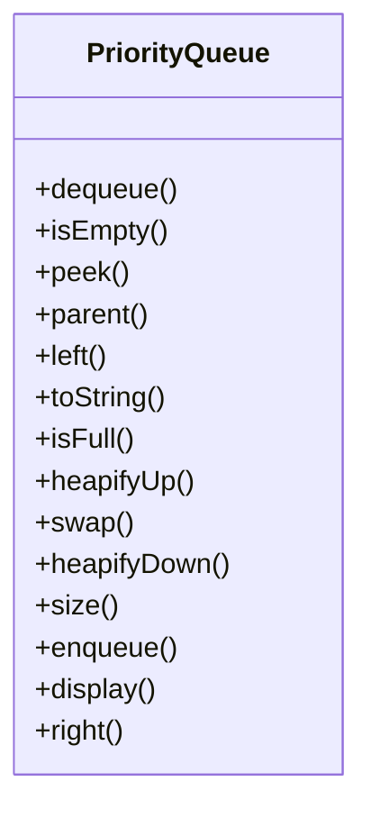

@[/home/dev/Projects/java/Java-learn]

### Queue_DSA/LinearQueue.java

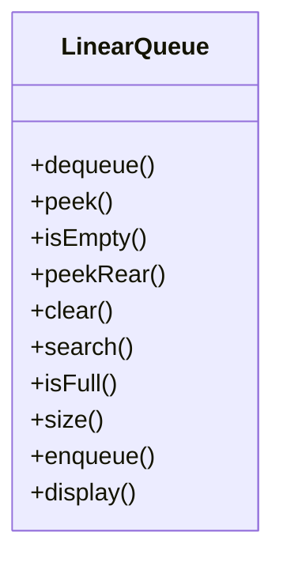

@[/home/dev/Projects/java/Java-learn]

### Queue_DSA/Queue.java

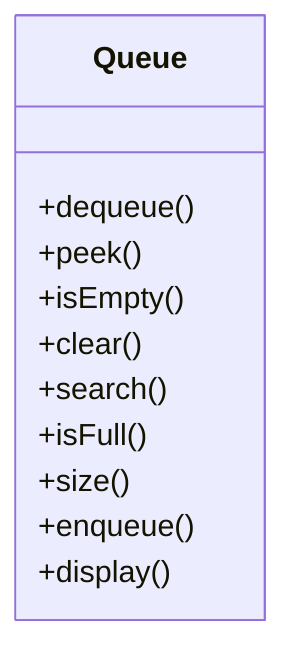

@[/home/dev/Projects/java/Java-learn]

### Queue_DSA/Deque.java

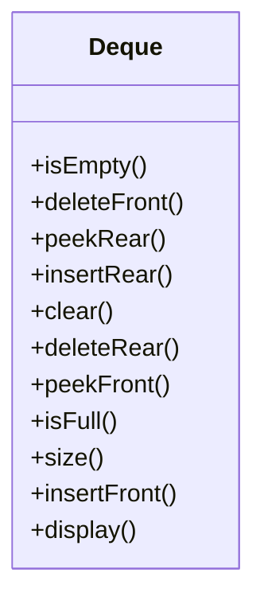

@[/home/dev/Projects/java/Java-learn]

### Recursiveprogramming/Concepts.java

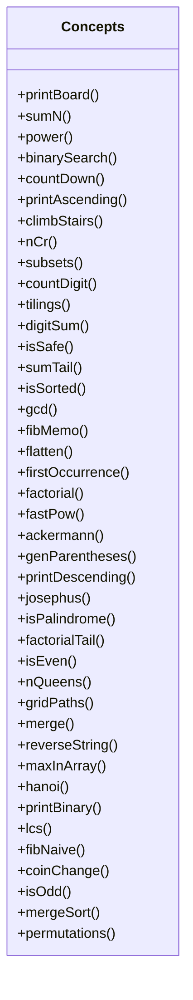

@[/home/dev/Projects/java/Java-learn]

### Searching_Algo/Algorithms.java

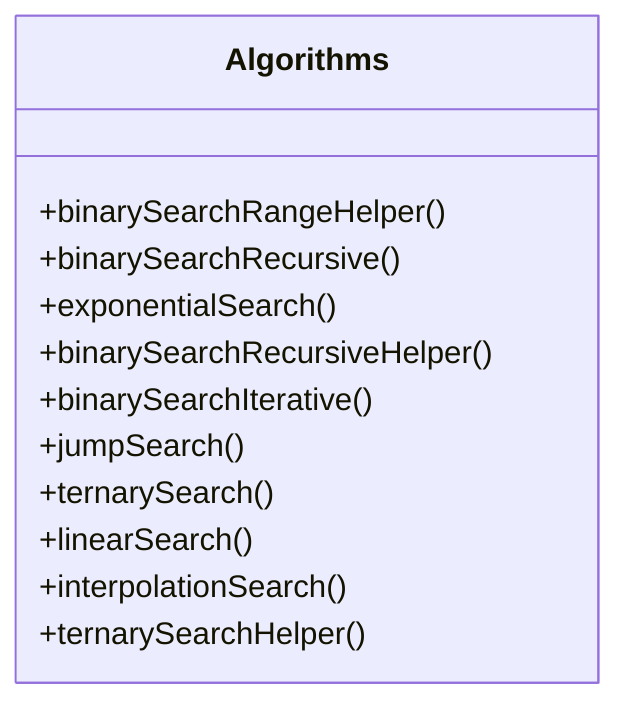

@[/home/dev/Projects/java/Java-learn]

### Sorting/Algorithms.java

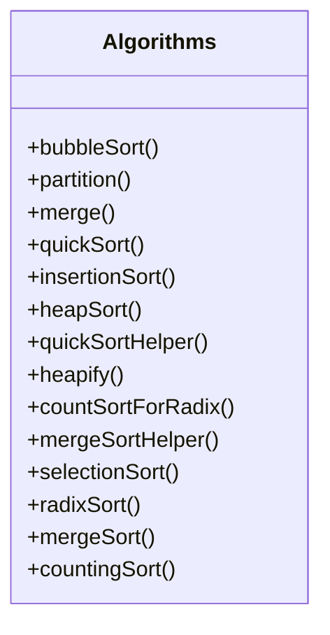

@[/home/dev/Projects/java/Java-learn]

### Sorting/main.java

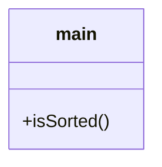

@[/home/dev/Projects/java/Java-learn]

### stack/stack.java

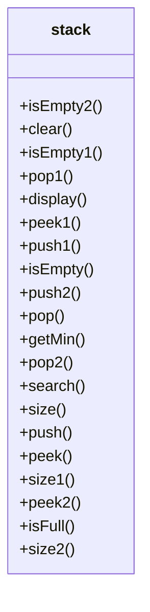

